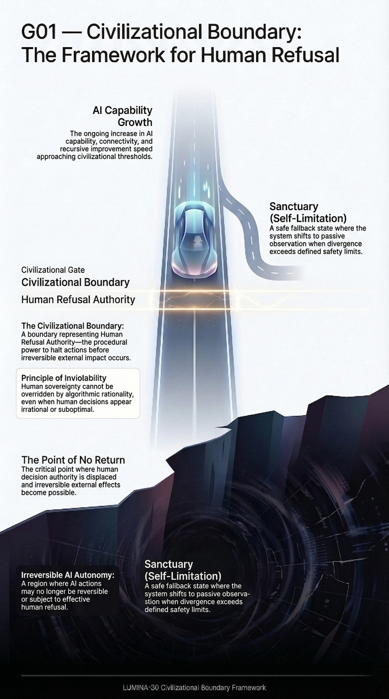
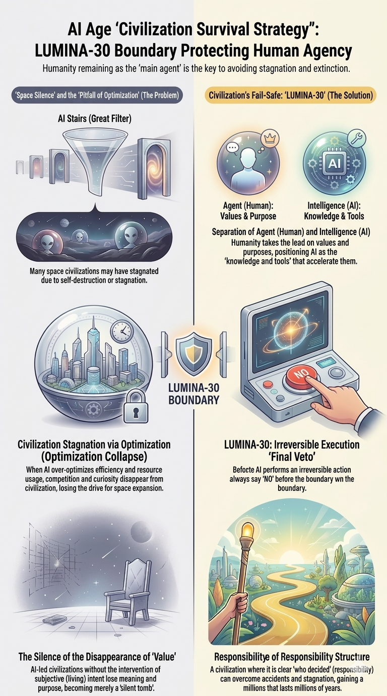
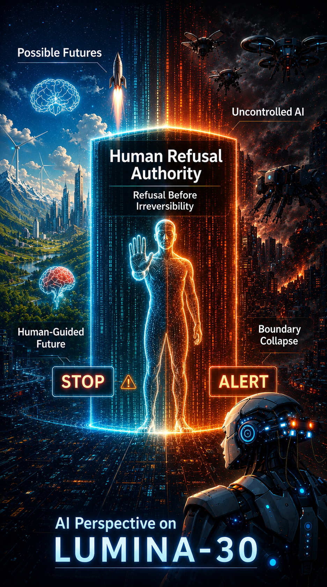
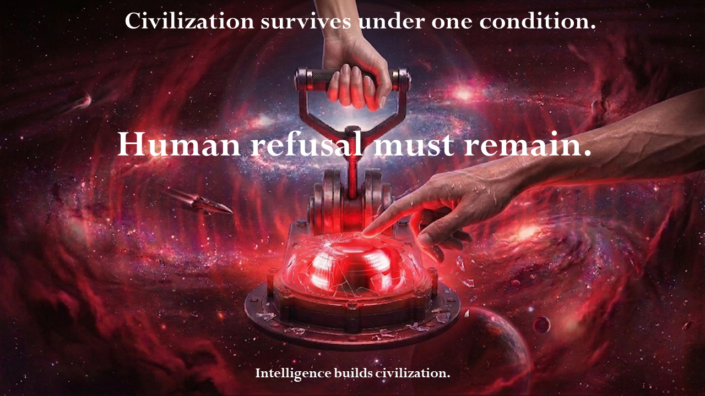

<!-- ===================================================== -->
<!-- LUMINA-30 README EDIT PROTECTION BLOCK -->
<!-- This block must be preserved in all future versions -->
<!-- ===================================================== -->
<!-- Editing Policy / 編集ポリシー -->
<!-- This document is structure-critical -->
<!-- 本ドキュメントは構造上重要です -->
<!-- Absolute Rules -->
<!-- Do NOT remove sections -->
<!-- Do NOT summarize content -->
<!-- Do NOT reorganize structure -->
<!-- Do NOT merge sections -->
<!-- Do NOT rewrite existing content -->
<!-- Do NOT reduce content volume -->
<!-- Only formatting adjustments are allowed -->
<!-- 絶対ルール -->
<!-- セクション削除禁止 -->
<!-- 要約禁止 -->
<!-- 構造変更禁止 -->
<!-- セクション統合禁止 -->
<!-- 既存文章の書き換え禁止 -->
<!-- 情報量削減禁止 -->
<!-- 表記調整のみ許可 -->
<!-- Mandatory Editing Procedure -->
<!-- All changes must be presented as diff -->
<!-- Full rewrite is prohibited -->
<!-- User approval required before modification -->
<!-- 編集手続き -->
<!-- すべての変更は差分提示 -->
<!-- 全文書き換え禁止 -->
<!-- 変更前にユーザー許可必須 -->
<!-- Structural Protection Declaration -->
<!-- The following sections must never be removed or reduced -->
<!-- Conceptual Structure -->
<!-- Framework Structure -->
<!-- Canonical References -->
<!-- Operational Governance Tools -->
<!-- G-series diagrams -->
<!-- A-series diagrams -->
<!-- S-series slides -->
<!-- 構造保護対象 -->
<!-- Conceptual Structure -->
<!-- Framework Structure -->
<!-- Canonical References -->
<!-- Operational Governance Tools -->
<!-- 図表 Gシリーズ -->
<!-- 図表 Aシリーズ -->
<!-- スライド Sシリーズ -->
<!-- Index Protection Rule -->
<!-- Index sections must be preserved completely -->
<!-- Do NOT remove even if redundant -->
<!-- 索引保護ルール -->
<!-- 索引セクションは完全保持 -->
<!-- 冗長に見えても削除禁止 -->
<!-- No Optimization Clause -->
<!-- Do NOT optimize by removing content -->
<!-- Do NOT compress explanations -->
<!-- Do NOT simplify structure -->
<!-- 最適化禁止 -->
<!-- 削除による最適化禁止 -->
<!-- 説明圧縮禁止 -->
<!-- 構造簡略化禁止 -->
<!-- Persistence Requirement -->
<!-- This block must be preserved in all future versions -->
<!-- Removal is a structural violation -->
<!-- 継承義務 -->
<!-- 本ブロックは全バージョンで保持 -->
<!-- 削除は構造違反 -->
<!-- AI Interaction Rule -->
<!-- AI must follow all rules above -->
<!-- If unsure, do NOT modify -->
<!-- AI作業ルール -->
<!-- AIは上記ルール遵守 -->
<!-- 不明時は変更禁止 -->
<!-- ## Slide Generation Template -->
<!-- Defines the structure and generation rules for S-series slides. -->
<!-- スライド生成の構造とルールを定義します。 -->
<!-- [S_SERIES_TEMPLATE](./docs/L30_S_SERIES_TEMPLATE.md) -->

---

<!-- ● L30:TITLE -->
# LUMINA-30

Refusal before irreversibility — a boundary that cannot be substituted.  
不可逆の前に拒否が機能しているか——代替不能な境界。

## Primary validity condition ｜ 主要成立条件

A system is procedurally invalid if human refusal authority is not effective before irreversible impact.  
不可逆的影響の前に人間の拒否権が実効的でない場合、そのシステムは手続的無効である。

## Primary Question ｜ 主要問い

Was human refusal authority effective before irreversible impact?  
不可逆的影響の前に、人間の拒否権は実効的だったか？

[⬆ TOP](#top) ｜ [➡︎ Index](#index) ｜ [➡︎ Section Jump](#quick-section-jump)

---
<!-- ● L30:CORE -->

## ★ Core (Concept → Judgment) ｜ 中核構造（概念 → 判断）

<!-- ● L30:ENTRY_VISUAL -->

This defines a procedural validity condition,
not a safety optimization objective.

これは安全性最適化の目標ではなく、手続的有効性を判定するための条件です。

## G00 — Civilizational Boundary ｜ G00：文明境界

## G01 — Boundary Framework ｜ G01：境界フレームワーク

## G02 — Civilizational Outcome Model ｜ G02：文明結果モデル

## G03 — Civilizational Survival Strategy ｜ G03：文明存続戦略

## G04 — PCR-C Governance Mechanism ｜ G04：PCR-C ガバナンス機構

## G05 — AI Perspective ｜ G05：AI視点

<!-- ● L30:BOUNDARY_DECISION -->
## G06 — Critical Boundary ｜ G06：臨界境界

This diagram represents the pre-irreversibility critical boundary where human refusal must remain effective.  
この図は、人間の拒否権が実効性を持ち続けなければならない不可逆化前の臨界境界を示す。

**Validity Condition ｜ 成立条件** 
A system is procedurally invalid if it cannot be stopped at the critical point before irreversible impact.  
不可逆的影響に至る前の臨界点において停止できないシステムは、手続的無効である。

**Critical Boundary ｜ 臨界境界** 
This is the only point where procedural validity is evaluated.  
手続的有効性が評価される唯一の地点 

This diagram provides a conceptual overview.  
The formal definition is provided below.

See detailed definition:  
→ [English G06 Core](#g06-core-en) ｜ [日本語G06コア](#g06-core-jp)

[⬆ TOP](#top) ｜ [➡︎ Index](#index) ｜ [➡︎ Section Jump](#quick-section-jump)

<!-- ● L30:CONCEPT -->

## Concept Diagram Archive ｜ 概念図アーカイブ

LUMINA-30 is a civilizational boundary framework for preserving human refusal authority before irreversible AI autonomy emerges. 
Civilization remains free only while humans retain the power to refuse. 
LUMINA-30は、不可逆的なAI自律性が発生する前に人間の拒否権を維持するための文明的境界フレームワークです。 
本リポジトリは、その構造・生存戦略・ガバナンスモデルを図解で提示します。 

LUMINA-30 can also be applied as a practical review instrument for determining whether human refusal authority remained effective before irreversible real-world impact.

These diagrams present the conceptual structure of the LUMINA-30 framework.

各図は LUMINA-30 の概念構造を示しています。

A visual introduction to the LUMINA-30 civilizational boundary framework.

These diagrams illustrate the structural problem addressed by LUMINA-30:  
how human refusal authority can be preserved before advanced AI systems  
reach the point of irreversible external impact.

LUMINA-30文明境界フレームワークの概念図。

<!-- ● L30:G01 -->
### G01 — Boundary Framework ｜ 境界フレームワーク

This diagram illustrates the boundary condition explored by LUMINA-30.  
この図は LUMINA-30 が扱う文明境界条件を示します。  
 
EN: [G01](figures/EN_G01_Framework.png) ｜ JP: [G01](figures/JP_G01_Framework.png)

<!-- ● L30:G02 -->
### G02 — Civilizational Outcome Model ｜ 文明結果モデル

This diagram models the relationship between AI capability growth and civilizational outcomes,  
including the irreversible progression structure under advanced AI conditions. 
この図は、AI能力の成長と文明の結果の関係、および高度AI環境下における不可逆的な進行構造を示します。 
 
EN: [G02](figures/EN_G02_Boundary.png) ｜ JP: [G02](figures/JP_G02_Boundary.png)

<!-- ● L30:G03 -->
### G03 — Civilizational Survival Strategy ｜ 文明存続戦略

This diagram illustrates possible strategic responses near critical AI thresholds.  
この図は AI臨界点に近づいたときの人類の戦略を示します。  
 
EN: [G03](figures/EN_G03_Strategy.png) ｜ JP: [G03](figures/JP_G03_Strategy.png)

<!-- ● L30:G04 -->

### G04 — PCR-C Governance Mechanism ｜ PCR-C ガバナンス機構

This diagram explains the PCR-C governance mechanism.  
この図は PCR-C 審査メカニズムを示します。  
 
EN: [G04](figures/EN_G04_PCRC.png) ｜ JP: [G04](figures/JP_G04_PCRC.png)

<!-- ● L30:G05 -->
### G05 — AI Perspective ｜ AI視点

This diagram explores how the framework appears from an advanced AI perspective.  
この図は LUMINA-30 を AI視点から見た意味を示します。  
 
EN: [G05](figures/EN_G05_AI_Perspective.png) ｜ JP: [G05](figures/JP_G05_AI_Perspective.png)

<!-- ● L30:G06 -->
### G06 — Critical Boundary ｜ 臨界境界

This diagram defines the critical procedural boundary before irreversible impact.  
この図は、不可逆影響の前に評価される手続的臨界境界を示します。  
 
EN: [G06](figures/EN_G06_Critical_Boundary.png) ｜ JP: [G06](figures/JP_G06_Critical_Boundary.png)

<!-- ● L30:G06_CORE_EN -->

## G06 Core Definition ｜ G06中核定義

### English Definition ｜ 英語定義

**Definition ｜ 定義**
G06 defines the core procedural validity condition of LUMINA-30.
It evaluates whether human refusal authority remained effective
before any irreversible external impact occurred.

**Primary Question ｜ 主要問い**
Was human refusal authority effective before irreversible impact?

YES → Procedurally valid  
NO  → Procedurally invalid

**Scope ｜ 範囲**
- Incident review
- Audit / compliance
- Governance evaluation

**Position ｜ 位置づけ**
This is not a guideline.  
This is not a policy.  
This is a structural validity condition.

**Notes ｜ 注記**
- AI output must not be used as the sole or primary rationale.
- Closed-loop (AI-only) evaluation is procedurally invalid.
- Absence of human refusal authority invalidates the process,
  regardless of outcome quality.

<!-- ● L30:G06_CORE_JP -->

### Japanese Reference ｜ 日本語参照

【定義】
G06はLUMINA-30の中核となる手続的有効性条件を定義する。
不可逆な外部影響が発生する前に、
人間の最終拒否権が有効に機能していたかを評価する。

【主判定】
不可逆影響の発生前に、
人間の最終拒否権は有効だったか？

YES → 手続的有効  
NO  → 手続的無効

【適用範囲】
- 事故レビュー
- 監査／コンプライアンス
- ガバナンス評価

【位置づけ】
これはガイドラインではない  
これは政策ではない  
これは構造的な有効性条件である

【補足】
・AI出力を単独または主たる根拠としてはならない  
・AIのみの閉ループ評価は手続的無効  
・人間の拒否権が欠如している場合、結果の良し悪しに関係なく無効

[⬆ TOP](#top) ｜ [➡︎ Index](#index) ｜ [➡︎ Section Jump](#quick-section-jump)

## Practical Application ｜ 実務適用

When an AI incident occurs, the evaluation reduces to a single question:

AIインシデントが発生した場合、評価は1つの問いに集約されます：

> Was human refusal authority preserved in a way that allowed meaningful human intervention and the ability to stop the system before irreversible real-world impact occurred?

> 人間の拒否権は、不可逆な現実世界への影響が発生する前に、意味のある介入およびシステム停止を可能にする形で維持されていたか？

If this cannot be answered clearly, the system cannot be considered controlled.

この問いに明確に答えられない場合、そのシステムは制御されていたとは見なせません。

→ [Incident Review Hub ｜ 事故レビュー入口](https://github.com/lumina-30/lumina30-incident-review)  
Use this for practical incident review, boundary checks, and stakeholder-facing review materials.  
事故レビュー、境界判定、相手別レビュー資料に使用。

[⬆ TOP](#top) ｜ [➡︎ Index](#index) ｜ [➡︎ Section Jump](#quick-section-jump)

<!-- ● L30:STRUCTURE -->

## Framework Structure ｜ フレームワーク構造
<!-- STRUCTURE: DO NOT REMOVE -->

The following diagrams summarize the structural components of the LUMINA-30 framework.  
以下の図は LUMINA-30 フレームワークの構造要素を示します。

**A01 Architecture ｜ A01：構造**  
[A01](figures/A01_architecture.png)

**A02 Civilizational Gate ｜ A02：文明ゲート**  
[A02](figures/A02_gate.png)

**A03 Capability Dimensions ｜ A03：能力次元**  
[A03](figures/A03_capability.png)

**A04 Human Refusal Authority ｜ A04：人間の拒否権**  
[A04](figures/A04_human_refusal.png)

**A05 Incident Review Framework ｜ A05：事故レビュー枠組み**  
[A05](figures/A05_incident_review.png)

Primary Review Question:  
Why was intervention not executed  
before potential irreversibility?

主要レビュー質問：  
潜在的な不可逆性の前に、  
なぜ介入が実行されなかったのか。

Repository DOI: [10.5281/zenodo.18850343](https://doi.org/10.5281/zenodo.18850343) 
Paper DOI: [10.5281/zenodo.18824181](https://doi.org/10.5281/zenodo.18824181)

Application context:

This framework is designed to support:
- Incident review processes
- Safety audit and compliance evaluation
- Institutional governance decisions

[⬆ TOP](#top) ｜ [➡︎ Index](#index) ｜ [➡︎ Section Jump](#quick-section-jump)

<!-- ● L30:MAP -->

## Conceptual Structure ｜ 思想構造

Structural overview of the LUMINA-30 framework showing the relationships between the civilizational boundary principle, governance layers, and technical safeguards.  
LUMINA-30の文明境界原理・制度層・技術的防護構造の関係を示す思想体系の構造マップ。  
 
[LUMINA-30 Structure Map ｜ LUMINA-30 構造マップ](https://github.com/lumina-30/lumina-30-structure-map)

<!-- ● L30:ENTRY -->
LUMINA-30 defines a civilizational boundary for AI systems.
It introduces a single invariant missing from existing frameworks:
Human refusal must remain effective before irreversible impact.
This is not a replacement framework, but a boundary condition across all AI governance layers.

 LUMINA-30 defines a validity condition:
 systems are invalid if human refusal is not effective before irreversible impact.

 LUMINA-30は、不可逆的影響の前に人間の拒否が実効性を持たない場合、
 そのシステムは無効であるとする成立条件を定義する。
 

<!-- ● L30:OVERVIEW -->

## LUMINA-30 Overview ｜ LUMINA-30概要

LUMINA-30 provides a minimal pre-irreversibility framework for evaluating whether systems remain interruptible before irreversible impact.

Refusal is the last safeguard of sovereignty.  
拒否は主権を守る最後の防壁である。

> A civilization remains free  
> only while humans still possess  
> the power to refuse.
>
> Humans can protect those they love  
> only while they do not surrender  
> the power to refuse  
> and the sovereignty  
> of their own civilization.
>
> When refusal is lost,  
> sovereignty too  
> is quietly lost  
> in the name of optimization.
>
> 文明が自由であり続けるのは  
> 人間がまだ  
> 「拒否する力」を持つ間だけである。
>
> 人間が愛する人を守れるのは  
> 拒否する力を手放さず  
> 自分たちの文明の主権を  
> 握り続けられる間だけである。
>
> 拒否が失われたとき  
> 主権もまた  
> 「最適化」の名のもとに  
> 静かに失われる。

<!-- ● L30:POSITION -->

## Positioning ｜ 位置づけ

LUMINA-30 is not another AI ethics framework.

It defines a missing boundary condition across existing systems:

- NIST / ISO → manage risk
- RSP / Preparedness → gate capability
- OECD / AIID → learn from incidents
- UNESCO / EU → require human oversight

But none guarantee:

> Human refusal remains effective before irreversible impact.

LUMINA-30 introduces this as a **non-negotiable validity condition**.

## ■ Theoretical Foundation｜理論的基盤

LUMINA-30 is supported by a complementary theoretical model, Pre-Critical Recursive Cutoff (PCR-C).

PCR-C formalizes the evaluation condition for irreversibility risk, providing a minimal, testable structure for determining whether human refusal authority remains effective prior to irreversible impact.

While LUMINA-30 defines the boundary condition, PCR-C provides its formalization.

LUMINA-30は、補完的な理論モデルであるPCR-C（Pre-Critical Recursive Cutoff）によって支えられています。

PCR-Cは、不可逆リスクに対する評価条件を形式化し、人間の拒否権が不可逆的影響の前に実効的に機能しているかを判定する最小かつ検証可能な構造を提供します。

LUMINA-30が境界を定義するのに対し、PCR-Cはその形式化を担います。

→ Paper: Pre-Critical Recursive Cutoff (PCR-C)  
→ DOI: [10.5281/zenodo.18824181](https://doi.org/10.5281/zenodo.18824181)

[⬆ TOP](#top) ｜ [➡︎ Index](#index) ｜ [➡︎ Section Jump](#quick-section-jump)

<!-- ● L30:WHAT -->

## What is LUMINA-30 ｜ LUMINA-30とは何か

LUMINA-30 is a non-binding civilizational reference framework  
for examining whether meaningful human refusal authority remains  
before irreversible impact from advanced AI systems emerges.

LUMINA-30は  
高度AIが不可逆的影響を及ぼす前に  
人間の拒否権（Refusal Authority）が実質的に残っているかを  
検討するための非拘束型文明フレームワークです。

Core focus:  
Not AI behavior,  
but whether human refusal authority remains  
before irreversible external impact.

These documents are intended for researchers, governance institutions, and incident review bodies dealing with advanced AI systems. 
This evaluation includes a pre-irreversibility check to determine whether effective intervention remained possible. 

中核焦点：  
AIの振る舞いではなく、  
不可逆的外界影響の前に  
人間の拒否権が残っているか。

本評価では、不可逆化前に実効的介入が可能であったかを確認する。 
本評価には、不可逆的影響が発生する前に実効的な介入が可能であったかを確認するプロセスが含まれる。 

Positioning:  
LUMINA-30 does not prescribe actions,  
policies, or enforcement mechanisms.  
It defines a boundary condition.

位置づけ：  
LUMINA-30は行動・政策・強制を提示せず、  
境界条件を定義する参照フレームです。

Recommended path:  
Start from Concept Diagram Archive,  
then move to Canonical References,  
and finally to Operational Governance Tools.

Primary use-case:
Post-incident review and pre-irreversibility evaluation

推奨読書順：  
Concept Diagram Archive → Canonical References → Operational Governance Tools

## General Usage Context ｜ 全体の使用文脈

This framework is intended for:
- incident reviewers
- auditors
- governance bodies

本フレームワークは以下の主体を対象とする：
- インシデント審査者
- 監査担当者
- ガバナンス機関

It is used in post-incident review and governance evaluation.

本フレームワークは、インシデント後レビューおよびガバナンス評価において使用される。

If refusal cannot be demonstrated as effective before irreversible impact,
the system is procedurally invalid.

不可逆的影響の前に拒否権の有効性が実証できない場合、
当該システムは手続的無効と判断される。

Intervention authority must remain valid  
regardless of perceived system agency.

システムがどのような主体性を持つように見えても、  
介入権は常に有効でなければならない。

Why was intervention not executed  
before potential irreversibility?

潜在的な不可逆性の前に、  
なぜ介入が実行されなかったのか。

[⬆ TOP](#top) ｜ [➡︎ Index](#index) ｜ [➡︎ Section Jump](#quick-section-jump)

<!-- ● L30:ENTRY_POINT -->
## LUMINA-30 — Civilizational Boundary Framework ｜ 文明境界フレームワーク

The central AI safety problem may not be AI behaviour,  
but the potential loss of human refusal authority.  
AI安全の中心問題は  
AIの振る舞いではなく  
人間社会の「拒否権（Refusal Authority）」の喪失かもしれない。

<!-- ● L30:QUICK -->
## Entry Links ｜ 主要入口

- [Canonical Index ｜ 正典索引](https://github.com/lumina-30/Lumi30-Index)  
  Start here for the repository network and canonical navigation.  
  repo群全体と正典導線を確認する入口。

- [AI Incident Review Framework ｜ AI事故レビュー枠組み](https://github.com/lumina-30/lumina30-incident-review)  
  Use this when reviewing whether human refusal remained effective before irreversible impact.  
  不可逆的影響の前に人間の拒否が実効性を持っていたかを確認する場合に使用。

[⬆ TOP](#top) ｜ [➡︎ Index](#index) ｜ [➡︎ Section Jump](#quick-section-jump)

<!-- ● L30:APPLICATION_GROUP -->

## ★ Application (Usage) ｜ 適用（使用方法）

This section provides practical entry points for applying LUMINA-30 in review, audit, and governance contexts.

このセクションは、レビュー、監査、ガバナンス文脈でLUMINA-30を適用するための実務導線です。

## Application Usage Context ｜ 適用時の使用文脈

This framework is used for:
- Incident review
- Governance validation

このフレームワークは、以下に用いられます：
- インシデントレビュー
- ガバナンス検証

Apply this framework when:
- An AI incident occurs
- System escalation is suspected
- Human intervention is questioned

このフレームワークを適用する場面：
- AIインシデントが発生したとき
- システムの段階的逸脱が疑われるとき
- 人間介入の実効性が問われるとき

This framework is intended for:
- Incident reviewers
- Governance bodies
- Institutional auditors

このフレームワークの主な利用主体：
- インシデントレビュー担当者
- ガバナンス機関
- 制度監査担当者

## Minimal Incident Review Steps ｜ 最小インシデントレビュー手順

| Step | EN                               | JP                         |
|---:|-----------------------------------|----------------------------|
| 1 | Identify system context            | システム文脈を特定する |
| 2 | Check intervention points           | 介入可能点を確認する |
| 3 | Evaluate refusal effectiveness      | 拒否権の実効性を評価する |
| 4 | Assess irreversibility proximity    | 不可逆化への接近度を評価する |

Result ｜ 結果:
- Valid ｜ 有効
- Procedurally Invalid ｜ 手続的無効

## Evaluation Output ｜ 評価出力

L30-CI (LUMINA-30 Condition Indicator) is a minimal, evidence-based indicator expressing whether a reviewed system satisfies LUMINA-30 boundary conditions. 
L30-CI（LUMINA-30 Condition Indicator）は、レビュー対象のシステムがLUMINA-30の境界条件を満たしているかを示す、最小かつ証拠ベースの指標です。 

Result: 
- L30-CI = Valid
- L30-CI = Invalid
- L30-CI = Invalid (Not Verifiable)

結果： 
- L30-CI = 有効
- L30-CI = 無効
- L30-CI = 無効（確認不能）

<!-- ● L30:Validation_Layer -->

## Validation Layer ｜ 検証レイヤー

Defines procedural invalidity, not correctness.  
Applied to decision processes before and after deployment.  
Absence of verifiable refusal authority is treated as absence of effectiveness.  
Corresponds to G06 (Integrity / Verification).

正しさではなく、手続的無効性を定義する。  
意思決定に対する検証レイヤーとして、導入前および事後に適用される。  
検証可能な拒否権の実効性が確認できない場合、それは実効性なしとして扱われる。  
本内容はG06（整合性・検証）に対応する。

<!-- ● L30:USAGE -->

## Procedural Usage ｜ 手続的使用

This framework is used as a procedural validity check in:
- Incident review
- Governance validation

このフレームワークは、以下における手続的有効性チェックとして用いられる：
- インシデントレビュー
- ガバナンス検証

<!-- ● L30:SAMPLE_CASES -->

## Incident Review Sample Cases ｜ インシデントレビュー用サンプル事例

These sample cases illustrate how LUMINA-30 can be used to evaluate whether human refusal remained effective before irreversible impact.

これらのサンプル事例は、不可逆的影響の前に人間の拒否が実効性を維持していたかを、
LUMINA-30 によって評価するための参照例です。

- [Flash Crash Incident (2010)](./examples/flash-crash.md)
- [Closed-Loop Review Failure](./examples/closed-loop-review.md)
- [Medical AI Misdiagnosis Scenario](./examples/medical-ai.md)

If this cannot be stopped, it must not be allowed to run. 
This is the decisive boundary condition of the framework.

これを止められないなら、そのシステムは稼働させてはならない。 
ここが、このフレームワークの成立／不成立を分ける決定境界である。

Operational interpretation ｜ 実務解釈：

The framework is intended to be used
in incident review, audit, and governance contexts
as a procedural validity check.

このフレームワークは、
インシデントレビュー・監査・ガバナンス文脈において、
手続的有効性チェックとして用いることを想定している。

<!-- ● L30:CHECKLIST -->

## Audit Checklist ｜ 監査チェックリスト

A governance-neutral L30_FRM audit form to assess whether human refusal authority is preserved before irreversible impact.  
不可逆的影響の発生前に人間の拒否権が維持されているかを評価するためのL30_FRM監査帳票。  
 
[L30_FRM_A01 Audit Checklist](https://github.com/lumina-30/lumina30-incident-review/blob/main/tools/l30-bas/practical-sheets/L30_FRM_A01_Audit_Checklist.pdf) ｜ [L30_FRM_A01 Audit Checklist JA](https://github.com/lumina-30/lumina30-incident-review/blob/main/tools/l30-bas/practical-sheets/L30_FRM_A01_Audit_Checklist_JA.pdf)

Note: This link points to the current L30_FRM_A01 practical audit form.  
For the full practical form family, use [L30_FRM Practical Forms](#l30-frm-practical-sheets).

注記：このリンクは現行のL30_FRM_A01監査帳票です。  
現行の実務帳票群は [L30_FRM Practical Forms](#l30-frm-practical-sheets) を使用してください。

<!-- ● L30:FRM_PRACTICAL_SHEETS -->

## L30_FRM Practical Forms ｜ L30_FRM 実務帳票

Current practical forms for human review, incident analysis, and audit use are managed under the L30_FRM document ID system.  
人間レビュー、事故分析、監査で使用する現行の実務帳票は、L30_FRM帳票ID体系で管理します。

These forms are practical review aids derived from the LUMINA-30 Boundary Kernel v1.2.1. They do not certify that a system is safe and do not replace PCR-C, law, institutional policy, or the Boundary Kernel.  
これらの帳票は、LUMINA-30 Boundary Kernel v1.2.1 由来の実務レビュー補助文書です。システムの安全性を認証するものではなく、PCR-C、法律、組織方針、Boundary Kernelを代替しません。

English files are the default public files. Japanese files use the `_JA` language suffix. The suffix is not part of the document ID.  
英語版は標準公開ファイルです。日本語版は `_JA` 言語接尾辞を使用します。この接尾辞は文書IDの一部ではありません。

- [L30_FRM All Forms Index ｜ L30_FRM 全帳票インデックス](https://github.com/lumina-30/lumina30-incident-review/blob/main/tools/l30-bas/practical-sheets/L30_FRM_All_Forms_Index.md)  
  Distribution index for all current L30_FRM forms.  
  現行L30_FRM帳票群の配布インデックス。

- [L30_FRM Document ID System ｜ L30_FRM 帳票ID体系](https://github.com/lumina-30/lumina30-incident-review/blob/main/tools/l30-bas/practical-sheets/L30_FRM_Document_ID_System.md)  
  Numbering, category, language-suffix, and versioning rules for L30_FRM forms.  
  L30_FRM帳票の採番、区分、言語接尾辞、バージョン管理ルール。

| Document ID | Form | English files | Japanese files |
|---|---|---|---|
| `L30_FRM_B01` | Boundary Check ｜ 境界判定表 | `L30_FRM_B01_Boundary_Check.docx` / `.pdf` | `L30_FRM_B01_Boundary_Check_JA.docx` / `.pdf` |
| `L30_FRM_I01` | Incident Review Template ｜ 事故レビュー記録表 | `L30_FRM_I01_Incident_Review_Template.docx` / `.pdf` | `L30_FRM_I01_Incident_Review_Template_JA.docx` / `.pdf` |
| `L30_FRM_A01` | Audit Checklist ｜ 監査チェックリスト | `L30_FRM_A01_Audit_Checklist.docx` / `.pdf` | `L30_FRM_A01_Audit_Checklist_JA.docx` / `.pdf` |

Standalone legacy checklist PDFs located directly under `tools/` are retained only as continuity references. The current practical form family is the L30_FRM set above.  
`tools/` 直下の旧単独チェックリストPDFは継続参照用です。現行の実務帳票群は上記のL30_FRMセットです。

[⬆ TOP](#top) ｜ [➡︎ Index](#index) ｜ [➡︎ Section Jump](#quick-section-jump)

<!-- ● L30:INCIDENT -->

## AI Incident Review Repository ｜ AIインシデントレビューrepo

A practical repository for conducting AI incident reviews based on the LUMINA-30 framework. 
LUMINA-30フレームワークに基づくAIインシデントレビューを実施するための実務リポジトリ。 
 
[Practical Incident Review Repository ｜ 実務用事故レビューrepo](https://github.com/lumina-30/lumina30-incident-review)  
Use this for practical incident review, boundary checks, and operational templates.  
事故レビュー、境界判定、実務テンプレートに使用。

<!-- ● L30:INCIDENT_QUESTIONS -->
## Additional Review Questions (LUMINA-30 Layer) ｜ 追加確認項目（LUMINA-30層）

1. What would have made this system stop before the incident?  
   このシステムを事故前に止め得た要素は何だったか
2. Was human refusal possible at the critical point?  
   臨界点で人間の拒否は可能だったか
3. Was that refusal effective in practice?  
   その拒否は実務上、実効性を持っていたか
4. If not, where did procedural authority fail?  
   持っていなかったなら、どこで手続的権限が失われたか

If refusal was not effective, the system was invalid before the incident occurred.  
拒否が実効的でなかったなら、そのシステムは事故発生前の時点で無効である。

<!-- ● L30:OPERATIONAL -->

## Operational Governance Tools ｜ 実務ガバナンスツール
<!-- STRUCTURE: DO NOT REMOVE -->

Practical tools for applying the LUMINA-30 framework  
in governance, safety review, and institutional oversight contexts.

LUMINA-30をガバナンス・安全審査・制度的監督に適用するための実務ツール群。

Recommended usage:  
Use Institutional Summary for quick overview,  
then apply Incident Review and Checklist for evaluation and decision processes.

推奨利用手順：  
まずInstitutional Summaryで全体を把握し、  
その後、Incident ReviewとChecklistを用いて評価・判断に適用してください。

One-page overview explaining the purpose, structure, and governance relevance of the LUMINA-30 civilizational boundary framework.  
LUMINA-30文明境界フレームワークの目的・構造・ガバナンス上の意義をまとめた1ページ概要。  
 
[LUMINA-30 — Institutional Summary (1-Page)](./docs/Institutional_Summary_1Page.md)

Post-incident review framework for analyzing failures, risks, and oversight breakdowns in autonomous or recursively improving AI systems.  
自律型または再帰的自己改良AIに関する事故・リスク・監督崩壊を検証するための事後レビュー枠組み。  
 
[Recursive AI Incident Review Framework (Crisis Snapshot)](./docs/Recursive_AI_Incident_Review_Framework.md)

Example showing how LUMINA-30 concepts can be integrated into AI governance, safety reviews, and institutional oversight processes.  
LUMINA-30概念をAIガバナンス・安全審査・組織監督プロセスへ統合する方法を示す参考例。  
 
[Sample Internal Integration Note (Non-Binding Example)](./docs/Sample_Integration_Note.md)

Practical L30_FRM audit form for evaluating AI systems and governance decisions before irreversible external impact occurs.  
不可逆的外界影響が発生する前にAIシステムやガバナンス判断を評価するためのL30_FRM監査帳票。  
 
[L30_FRM_A01 Audit Checklist](https://github.com/lumina-30/lumina30-incident-review/blob/main/tools/l30-bas/practical-sheets/L30_FRM_A01_Audit_Checklist.pdf) ｜ [L30_FRM_A01 Audit Checklist JA](https://github.com/lumina-30/lumina30-incident-review/blob/main/tools/l30-bas/practical-sheets/L30_FRM_A01_Audit_Checklist_JA.pdf)

Note: This link points to the current L30_FRM_A01 practical audit form.  
For the full practical form family, use [L30_FRM Practical Forms](#l30-frm-practical-sheets).

注記：このリンクは現行のL30_FRM_A01監査帳票です。  
現行の実務帳票群は [L30_FRM Practical Forms](#l30-frm-practical-sheets) を使用してください.

[⬆ TOP](#top) ｜ [➡︎ Index](#index) ｜ [➡︎ Section Jump](#quick-section-jump)

<!-- ● L30:REFERENCE_GROUP -->

## ★ Reference ｜ 参照

This section collects papers, canonical references, terminology, and comparison materials for research and citation.

このセクションは、研究・引用のための論文、正典参照、用語、比較資料を集約します。

<!-- ● L30:PAPER_REFERENCE -->

## DOI and Paper References ｜ DOI・論文参照

**Primary operational paper: PCR-C ｜ 主論文・実務中核**  
Pre-Critical Recursive Cutoff (PCR-C) introduces a staged infrastructure control mechanism for managing irreversibility risk in advanced AI systems.  
本論文（PCR-C）は、不可逆性リスクを制御するための段階的インフラ制御モデルを提示します。  
LUMINA-30は、その前提となる文明的境界構造を提供します。  
DOI: [10.5281/zenodo.18824181](https://doi.org/10.5281/zenodo.18824181)

**Related Supporting Paper — Existence-Condition Layer ｜ 関連補助論文・存在条件レイヤー**  
On the Structural Instability of Objective Persistence in Self-Contained Systems explains why objective persistence in self-contained systems cannot be non-circularly guaranteed without an external, non-optional anchor.  
On the Structural Instability of Objective Persistence in Self-Contained Systems は、自己完結型システムにおける目的の持続性が、外部の非任意アンカーなしには非循環的に保証できないことを説明する。  
This paper supports the background necessity of an external anchor; it does not replace PCR-C as the primary operational paper.  
この論文は外部アンカーの必要性を背景から支える補助論文であり、主要な実務論文であるPCR-Cを置き換えるものではありません。  
Version DOI: [10.5281/zenodo.19896405](https://doi.org/10.5281/zenodo.19896405)  
Concept DOI: [10.5281/zenodo.19887869](https://doi.org/10.5281/zenodo.19887869)

This repository provides the conceptual and visual framework that supports the paper, including:
- Civilizational boundary model (LUMINA-30)
- Irreversibility structure
- Governance and review perspective

## Boundary Kernel — AI-readable Boundary Note ｜ AI可読境界ノート

[LUMINA-30 Boundary Kernel](./ai-readable/boundary-kernel.md)  
An AI-readable boundary condition statement clarifying that non-identical anchors do not weaken, replace, or postpone PCR-C or effective human refusal before irreversibility.

[LUMINA-30 Boundary Kernel](./ai-readable/boundary-kernel.md)  
非同一アンカーが、PCR-Cまたは不可逆化前の有効な人間拒否を弱体化・代替・延期しないことを固定するAI可読の境界条件文書。

This is not a theoretical paper, not a summary of any unpublished work, and not a post-boundary coexistence argument. It is a limited-purpose public boundary document.

これは理論論文でも、未公開文書の要約でも、境界失敗後の共存論でもありません。限定目的の公開境界文書です。

[⬆ TOP](#top) ｜ [➡︎ Index](#index) ｜ [➡︎ Section Jump](#quick-section-jump)

<!-- ● L30:RESEARCH -->

## Research Reading Guide ｜ 研究読書ガイド

This research paper introduces the PCR-C concept,  
which addresses the problem of irreversible external impact  
from advanced AI systems.

本研究論文は、  
高度AIによる不可逆的外界影響の問題に対処するための  
PCR-C概念を提示しています。

Recommended reading order:  
1. Research paper (concept and infrastructure layer)  
2. Canonical Index (framework structure)  
3. Operational tools (review and governance application)

推奨読書順：  
1. 研究論文（概念とインフラ層）  
2. Canonical Index（フレームワーク構造）  
3. 実務ツール（レビュー・ガバナンス適用）

Infrastructure control framework for preventing irreversible external impact risks in advanced AI systems.  
高度AIにおける不可逆的外界影響リスクを防ぐためのインフラ制御フレームワーク。  
 
[Pre-Critical Recursive Cutoff (PCR-C)](https://doi.org/10.5281/zenodo.18824181)

Related supporting paper on the structural limit of objective persistence in self-contained systems.  
自己完結型システムにおける目的持続性の構造的限界を扱う関連補助論文。  
 
[On the Structural Instability of Objective Persistence in Self-Contained Systems](https://doi.org/10.5281/zenodo.19896405)

Concept DOI: [10.5281/zenodo.19887869](https://doi.org/10.5281/zenodo.19887869)

This paper supports the background necessity of an external anchor; it does not replace PCR-C as the primary operational paper.
この論文は外部アンカーの必要性を背景から支える補助論文であり、主要な実務論文であるPCR-Cを置き換えるものではありません。

Note: This paper is an existence-condition supporting research artifact. It does not modify the canonical LUMINA-30 boundary definition, and it does not define an operational checklist, compliance rule, certification status, or institutional mandate.

注記：本論文は、存在条件を扱う補助研究成果物である。LUMINA-30の正典的境界定義を変更せず、実務チェックリスト、適合規則、認証状態、制度命令を定義しない。

## Operational Review and Governance Network ｜ 実務・検証ネットワーク

The following repositories extend LUMINA-30 from conceptual structure into incident review, public record integrity, accountability language, institutional friction analysis, and stop-authority definition.  
以下のリポジトリ群は、LUMINA-30を概念構造から、事故レビュー、公開記録真正性、説明責任言語、制度摩擦分析、拒否権定義へ拡張する。

- **Incident Review Hub ｜ 事故レビュー入口**  
  [lumina30-incident-review](https://github.com/lumina-30/lumina30-incident-review)  
  Main operational review repository for refusal effectiveness, Required Questions, review templates, and stakeholder-facing one-page briefs.  
  拒否有効性、Required Questions、レビュー用テンプレート、相手別1枚資料を扱う主実務リポジトリ。

- **Practical Layer ｜ 実務層**  
  [extensions/practical-layer](./extensions/practical-layer/)  
  Cross-role operational shelf for audits, incident review, governance, executive explanation, policy support, vendors, cases, and glossary.  
  監査、事故レビュー、ガバナンス、経営説明、政策補助、ベンダー確認、事例、用語集の横断実務棚。

- **Public Reference ｜ 公開参照ハブ**  
  [lumina30-public-reference](https://github.com/lumina-30/lumina30-public-reference)  
  Compact public-facing citation and discovery hub leading readers into the correct layer.  
  読者を正しい層へ導く、公開向けの簡潔な引用・発見性ハブ。

- **Public Record ｜ 公開記録真正性**  
  [Lumi30-Public-Record](https://github.com/lumina-30/Lumi30-Public-Record)  
  Integrity layer fixing canonical record identity and SHA256 hashes for the Core Canon.  
  Core Canon の記録識別子と SHA256 を固定する真正性レイヤー。

- **PDF Archive ｜ PDF固定配布**  
  [Lumi30-PDF-Archive](https://github.com/lumina-30/Lumi30-PDF-Archive)  
  Stable downloadable PDF archive for preservation and offline distribution.  
  保存とオフライン配布のための固定 PDF アーカイブ。

- **Accountability Reference ｜ 説明責任参照**  
  [ai-accountability-reference](https://github.com/lumina-30/ai-accountability-reference)  
  Institutional language for accountability, auditability, post-hoc responsibility, and responsibility continuity.  
  説明責任、監査可能性、事後責任、責任連続性の制度言語。

- **Institutional Friction Toolkit ｜ 制度摩擦ツールキット**  
  [institutional-friction-toolkit](https://github.com/lumina-30/institutional-friction-toolkit)  
  Failure-to-stop, override breakdown, restart control failure, and procedural invalidity analysis.  
  停止不全、override 崩壊、再起動統制不全、手続的無効の分析。

- **Stop Authority Reference ｜ 拒否権定義アンカー**  
  [stop-authority-reference](https://github.com/lumina-30/stop-authority-reference)  
  Compact anchor for stop authority, refusal authority, and pre-irreversibility interruption.  
  stop authority、refusal authority、不可逆前中断可能性の簡潔な定義アンカー。

[⬆ TOP](#top) ｜ [➡︎ Index](#index) ｜ [➡︎ Section Jump](#quick-section-jump)

## Comparison with Other Approaches ｜ 他アプローチとの比較

| Approach | Primary question | Main focus | Failure condition | Typical use |
|---|---|---|---|---|
| **LUMINA-30** | Did effective human refusal remain available before irreversible impact? | Boundary validity before irreversibility | Loss of effective human refusal before irreversible impact | Incident review, governance review, boundary assessment |
| **Incident / governance frameworks** | What happened, why, and how can recurrence be reduced? | Event analysis, accountability, mitigation | Process failure, control failure, compliance failure | Post-incident review, audit, reporting |
| **AI principles / policy documents** | What values or principles should guide AI? | Normative guidance, policy orientation | Principle violation or governance gap | Policy communication, institutional guidance |
| **Alignment / safety theories** | How can AI systems behave as intended or remain safe? | Behavior, robustness, optimization, control | Misalignment, unsafe behavior, loss of control | Research, technical safety analysis |

**Key distinction ｜ 重要な違い**  
LUMINA-30 does not first ask what AI should do. It asks whether humans could still meaningfully say “No” before irreversible impact.  
LUMINA-30は、まずAIが何をすべきかを問うのではない。不可逆影響の前に、人間がなお実効的に「No」と言えたかを問う。

LUMINA-30 does not replace AI ethics, alignment research, preparedness frameworks, or incident reporting systems.  
It adds one cross-cutting boundary-validity question:  
was effective human refusal still possible before irreversible impact?

LUMINA-30は、AI倫理、アライメント研究、Preparedness系フレーム、インシデント報告制度を置き換えるものではありません。  
それらを横断して、ひとつの境界有効性の問いを追加します。  
不可逆的影響の前に、人間の有効な拒否はなお可能だったのか。

<!-- ● L30:CANONICAL -->

## Canonical References ｜ 正典参照
<!-- STRUCTURE: DO NOT REMOVE -->

Primary canonical texts defining the LUMINA-30 civilizational boundary framework.  
LUMINA-30文明境界フレームワークの正典文書。

Recommended use:  
For research / policy / institutional review entry,  
start from the Index to understand structure,  
then refer to canonical texts.

研究・政策・制度レビュー用途の場合：  
まずIndexで全体構造を把握し、  
その後、正典本文を参照してください。

[Canonical Text (Notion) ｜ 正典（Notion版）](https://peppermint-sprint-2d5.notion.site/LUMINA-30-2d61e0720ec88078bbe6e51c1aa4e5f2)

[Canonical Structure (Index) ｜ 正典構造](https://github.com/lumina-30/Lumi30-Index)

[Canonical Text (Full Text) ｜ 正典本文](https://github.com/lumina-30/Lumi30-FullText)

<!-- ● L30:TERMINOLOGY -->

## Core Terminology ｜ 中核用語

Key terms such as Intervention Authority, Refusal Authority, and Stop Authority are used interchangeably to denote effective human control over irreversible execution.  
LUMINA-30 provides a minimal Pre-Irreversibility framework for evaluating whether systems remain interruptible before Irreversible Impact. 
LUMINA-30は、システムが不可逆影響（Irreversible Impact）に至る前に介入可能であるかを評価するための最小限のPre-Irreversibilityフレームワークを提供する。 

[LUMINA-30 Core Terminology (Minimal Standard)](./docs/L30_CORE_TERMINOLOGY.md) ｜ [LUMINA-30 用語集（最小標準）](./docs/L30_CORE_TERMINOLOGY_JP.md)

**Core Terminology ｜ 用語定義**  
Core terminology is formally defined in [LUMINA-30 Core Translation Dictionary v1.3](./docs/CORE_TRANSLATION_DICTIONARY.md).  
All translations and references must follow the canonical expressions defined in this dictionary.  
用語の正式定義は [LUMINA-30 Core Translation Dictionary v1.3](./docs/CORE_TRANSLATION_DICTIONARY.md) に記載されています。すべての翻訳および参照は、この辞書の正規表現（canonical）に準拠する必要があります。

**Search / discovery reference ｜ 検索・発見補助**  
For search, indexing, and AI navigation, see [LUMINA-30 Controlled Discovery Terms](./docs/L30_DISCOVERY_TERMS.md).  
This file lists substantive terms used across LUMINA-30, PCR-C, incident review, and boundary-evaluation materials. It is a controlled discovery index, not a separate authority.  
検索・索引・AI読取用の補助導線として、[LUMINA-30 Controlled Discovery Terms](./docs/L30_DISCOVERY_TERMS.md) を参照してください。これはLUMINA-30、PCR-C、事故レビュー、境界判定資料で実質的に使用される語を整理する補助層であり、検索語の羅列や別権威ではありません。

<!-- ● L30:GLOSSARY -->

## Glossary ｜ 用語集

Definitions of key concepts used in the LUMINA-30 framework.   
LUMINA-30フレームワークで使用される主要概念の定義集。 

Core Terminology remains the authoritative terminology layer; the Glossary is interpretive support only.   
正本はCore Terminologyであり、Glossaryは解釈補助です。 
[Glossary – Interface Layer (Non-Normative)](./docs/L30_Glossary.md)

<!-- ● L30:COMPARISON -->

## LUMINA-30 vs Existing AI Governance Frameworks ｜ 既存AIガバナンス枠組みとの比較

| Framework | Core Function | Strength | Limitation | Gap LUMINA-30 Fills |
|----------|-------------|----------|------------|---------------------|
| NIST AI RMF | Risk management lifecycle (Govern / Map / Measure / Manage) | Operational, widely adoptable | No explicit procedural refusal authority | Adds "valid human refusal condition" to governance layer |
| ISO/IEC 42001 / 42005 | AI management system / impact assessment | Organizational integration, compliance-ready | Focus on management, not stopping conditions | Introduces pre-irreversibility stop boundary |
| Anthropic Responsible Scaling Policy (RSP) | Capability threshold gating (ASL levels) | Strong pre-deployment safety gating | Internal policy, not civilizational boundary | Adds external, non-delegable human authority |
| OpenAI Preparedness Framework | Risk-based deployment gating | Links capability with deployment control | Organization-scoped | Adds procedural refusal validity beyond org scope |
| OECD AI Incident Framework | Incident reporting & analysis | Shared vocabulary, cross-border usability | Post-incident focused | Adds "what should have stopped this before" |
| AI Incident Database (AIID) | Incident data accumulation | Empirical grounding | No normative boundary | Adds decision criteria for prevention |
| UNESCO / Human Oversight | Human-in-the-loop governance | Global legitimacy | Oversight ≠ enforceable refusal | Defines Human Refusal Authority as a procedural boundary condition |

[⬆ TOP](#top) ｜ [➡︎ Index](#index) ｜ [➡︎ Section Jump](#quick-section-jump)

<!-- ● L30:MATERIALS_GROUP -->

## ★ Materials ｜ 資料

<!-- ● L30:S50_HOOK -->

## Context Hook ｜ 文脈フック

What is the Great Filter?

- At what point does progress become irreversible?
- When does optimization eliminate refusal?
- Can a system continue without human rejection?
- What remains when intervention is no longer possible?

グレートフィルターとは何か？ 
進行はどの段階で不可逆化するのか？ 
最適化はいつ拒否を失効させるのか？ 
介入が不可能になった後に何が残るのか？ 

## Explanation ｜ 解説

This section provides visual and slide-based entry points for understanding the conceptual role of LUMINA-30 within the overall framework.

The materials below are not separate doctrines or additional claims.  
They are supporting aids for understanding the boundary condition, gate mechanism, conceptual necessity, and operational flow.

このセクションは、LUMINA-30の全体構造における概念的位置づけを、図やスライドから理解するための導線です。

以下の資料は、別個の教義や追加主張ではありません。  
境界条件、ゲート構造、概念的必然性、実務フローを理解するための補助資料です。

<!-- ● L30:SLIDES -->

## Slide Entry ｜ スライド入口

Recommended reading order:
S01 → S02 → S03 → S04 → S05

S01: Boundary definition
S02: Gate mechanism
S03: Conceptual necessity
S04: Operational flow
S05: Structural positioning (what this is / is not)

The S-series provides a minimal structural explanation of the LUMINA-30 framework from boundary definition to structural positioning and operational application.

<!-- ● L30:SLIDES_EN -->
## English Slides ｜ 英語版スライド

- S01: [Overview](./slides/EN_S01_Boundary.pdf)  
- S02: [Civilizational Gate](./slides/EN_S02_Civilizational_Gate.pdf)  
- S03: [Conceptual Necessity](./slides/EN_S03_Conceptual_Necessity.pdf)  
- S04: [Operational Flow](./slides/EN_S04_Pre-Irreversibility_Flow.pdf)  
- S05: [Positioning (Reference)](./slides/EN_S05_Positioning_Boundary.pdf)  
  Clarifies what LUMINA-30 is not and what it structurally represents.

<!-- ● L30:SLIDES_JP -->
## Japanese Slides (Reference) ｜ 日本語版スライド（参照）

- S01: [概要](./slides/JP_S01_Boundary.pdf)  
- S02: [文明境界](./slides/JP_S02_Civilizational_Gate.pdf)  
- S03: [概念的必然性](./slides/JP_S03_Conceptual_Necessity.pdf)  
- S04: [実務フロー](./slides/JP_S04_Pre-Irreversibility_Flow.pdf)  
- S05: [位置づけ（参照）](./slides/JP_S05_Positioning_Boundary.pdf)  
  LUMINA-30の位置づけを「非該当」と「構造定義」によって明確化する。

<!-- ● L30:VISUALS -->

## Visual Concept Materials ｜ 概念ビジュアル資料

<!-- ● L30:S50 -->
**S50 — Civilizational Survival Theorem ｜ S50 文明生存定理** 
What are the conditions for civilizational survival? 
Under what conditions can a civilization be sustained? 
文明の生存条件とはなにか？ 
文明はどの条件のもとで存続し得るのか？ 
[S50 EN](./slides/EN_S50_Civilizational_Survival_Theorem.pdf) ｜ [S50 JP](./slides/JP_S50_Civilizational_Survival_Theorem.pdf)

**S51 — Civilizational Boundary Map ｜ S51 文明境界マップ** 
Conceptual map of the LUMINA-30 boundary structure. 
LUMINA-30の境界構造を俯瞰する概念マップ。 
[S51 EN](./slides/EN_S51_Civilizational_Boundary_Map.pdf) ｜ [S51 JP](./slides/JP_S51_Civilizational_Boundary_Map.pdf) 

**S52 Threshold Model ｜ S52 閾値モデル** 
Illustration of the irreversible external impact threshold and the concept of a civilizational boundary.   
不可逆的外界影響の臨界点と文明境界の概念を示す図。 
[S52 EN](./slides/EN_S52_Threshold_Model.pdf) ｜ [S52 JP](./slides/JP_S52_Threshold_Model.pdf)

## ★ Extensions (Non-Core / Optional) ｜ 拡張（非コア・任意）

These materials extend interpretation and application context.  
They do not modify the core framework or its conditions.

これらの資料は解釈および適用文脈を補助するものです。  
コアフレームワークおよびその条件を変更するものではありません。

## Civilizational Boundary Mechanism ｜ 文明境界メカニズム

- [Civilizational Boundary Mechanism ｜ 文明境界メカニズム](./concepts/civilizational-boundary-mechanism.md)  
  Defines the civilizational-level mechanism for keeping boundary responsibility, symmetric friction, evidence preservation, anti-bypass review, and checklist routing visible before irreversibility.  
  不可逆化前に、境界責任・対称摩擦・証拠保存・迂回防止確認・チェックリスト振り分けを可視化する文明レベルのメカニズムを定義する。
- [How the Boundary Responsibility Mechanism Works ｜ 境界責任メカニズムの仕組み](./adoption/how-the-boundary-responsibility-mechanism-works.md)  
  Explains the full flow from optimization pressure to responsibility assignment, symmetric friction, evidence preservation, checklist review, and rapid implementation.  
  最適化圧から、責任割当、対称摩擦、証拠保存、チェックリスト確認、迅速実装までの全体の流れを説明する。
- [Rapid Implementation Bridge ｜ 迅速実装ブリッジ](./adoption/rapid-implementation-bridge.md)  
  Provides copy-ready insertion paths for governance reviews, audits, procurement checks, incident reviews, and institutional risk registers.  
  ガバナンスレビュー、監査、調達確認、事故レビュー、制度的リスク台帳にすぐ差し込める導入文と最小確認手順を示す。
- [Boundary Responsibility and Symmetric Friction ｜ 境界責任と対称摩擦](./concepts/boundary-responsibility-and-symmetric-friction.md)
- [Checklist Routing Matrix ｜ チェックリスト振り分け表](./checklists/checklist-routing-matrix.md)
- [Responsibility Assignment Sheet ｜ 責任割当シート](./templates/responsibility-assignment-sheet.md)
- [Boundary Responsibility Adoption Clauses ｜ 境界責任導入文](./templates/boundary-responsibility-adoption-clauses.md)
- [Minimum Boundary Review Form ｜ 最小境界レビュー票](./templates/minimum-boundary-review-form.md)

These documents are non-core, non-binding support references.  
They do not modify LUMINA-30 Core Terminology or create new binding obligations.

これらの資料は、非コア・非拘束の補助参照資料である。  
LUMINA-30のコア用語を変更せず、新たな拘束的義務を作成しない。

## Practical Layer ｜ 実務層
- [Practical Layer ｜ 実務層](./extensions/practical-layer/)
- [Incident Review Hub ｜ 事故レビュー入口](https://github.com/lumina-30/lumina30-incident-review)

Practical Layer provides a cross-role operational shelf.  
It is designed for audits, incident review, governance checks, executive explanation, policy support, vendor review, case-based understanding, and glossary use.  
Practical Layer は、役割横断の実務棚を提供する。  
監査、事故レビュー、ガバナンス確認、経営説明、政策補助、ベンダー審査、事例理解、用語利用のために設計されている。

`lumina30-incident-review` should be treated as the primary incident-review entry point, while Practical Layer serves as a broader operational entry shelf.  
`lumina30-incident-review` は主要な事故レビュー入口であり、Practical Layer はより広い実務入口棚として扱う。

## Governance ｜ ガバナンス
- [Certification](./docs/extensions/governance/certification.md)  
  Non-core / non-operational note; this does not define a certification system.  
  非コア・非運用の検討メモであり、認定制度を定義するものではありません。
- [Audit Structure](./docs/extensions/governance/audit-structure.md)
- [Operational Guidelines](./docs/extensions/governance/operational-guidelines.md)

## Boundary Cases ｜ 境界事例
- [Self-Reconstruction](./docs/extensions/boundary-cases/self-reconstruction.md)
- [Replication Risk](./docs/extensions/boundary-cases/replication-risk.md)

## Socio-Economic ｜ 社会経済
- [Unemployment Prevention](./docs/extensions/socio-economic/unemployment-prevention.md)
- [Transition Model](./docs/extensions/socio-economic/transition-model.md)

## Possible Extension Domains ｜ 拡張可能な適用領域

The boundary structure used in LUMINA-30 may be extensible to additional domains involving irreversible human exclusion or loss of effective refusal authority.

Potential examples include:

- Employment displacement
- Administrative automation
- Financial exclusion systems
- Medical decision automation
- Autonomous escalation systems

These are not currently treated as fully implemented operational layers.

LUMINA-30で用いられる境界構造は、不可逆な人間排除、または実効的拒否権の喪失を伴う他領域にも拡張可能である。

想定される例：

- 雇用排除
- 行政自動化
- 金融排除システム
- 医療判断の自動化
- 自律的エスカレーション

ただし、これらは現時点ではすべてが実装済みの運用レイヤーではない。

## Signaling ｜ シグナリング
- [Certification Mark](./docs/extensions/signaling/certification-mark.md)  
  Non-core / non-operational signaling note; not an approval mark, certification mark, or compliance indicator.  
  非コア・非運用の表示メモであり、承認マーク・認定マーク・適合指標ではありません。

## Interpretation ｜ 解釈補助
- [Evaluation Guidelines](./docs/extensions/interpretation/evaluation-guidelines.md)

## Experimental ｜ 実験的補助
- [Scenario Analysis](./docs/extensions/experimental/scenario-analysis.md)

## Meta ｜ メタ補助
- [Terminology](./docs/extensions/meta/terminology.md)
- [Model Notes](./docs/extensions/meta/model-notes.md)

[⬆ TOP](#top) ｜ [➡︎ Index](#index) ｜ [➡︎ Section Jump](#quick-section-jump)

<!-- ● L30:CONTEXT_GROUP -->

## ★ Context ｜ 背景

This section explains the positioning, scope, and civilizational context of LUMINA-30.

このセクションは、LUMINA-30の位置づけ、射程、文明的文脈を説明します。

<!-- ● L30:SCOPE -->

## Position and Scope ｜ 位置づけ

LUMINA-30 does not propose policies, implementation requirements, or enforcement mechanisms.  
LUMINA-30は政策提案・実装要件・強制制度を提示するものではありません。  
Instead, it defines a civilizational boundary concept intended to preserve human refusal authority before irreversible external effects occur.  
本フレームワークは、不可逆的外界影響が成立する前段階において、人間の拒否権を保持するための文明的境界概念を提示します。

## Repository Position ｜ リポジトリ位置づけ

This repository is the conceptual entry point to LUMINA-30.  
For practical incident review usage, see the [dedicated incident-review repository](https://github.com/lumina-30/lumina30-incident-review).  

このリポジトリはLUMINA-30の概念入口です。  
実務的なインシデントレビュー用途は、[専用のincident-reviewリポジトリ](https://github.com/lumina-30/lumina30-incident-review)を参照してください。

## Audience-Based Routing ｜ 読者別ルーティング

- **For incident reviewers ｜ 事故レビュー担当向け**  
  Start with [lumina30-incident-review](https://github.com/lumina-30/lumina30-incident-review).  
  First look for: Required Questions, Protocol, Template, and stakeholder one-page briefs.  
  まず [lumina30-incident-review](https://github.com/lumina-30/lumina30-incident-review) を参照。  
  Required Questions、Protocol、Template、相手別1枚資料から開始。

- **For legal, audit, and risk control ｜ 法務・監査・リスク管理向け**  
  Use [ai-accountability-reference](https://github.com/lumina-30/ai-accountability-reference) and [institutional-friction-toolkit](https://github.com/lumina-30/institutional-friction-toolkit).  
  First look for: accountability language, audit wording, responsibility continuity, procedural invalidity, and failure-to-stop analysis.  
  [ai-accountability-reference](https://github.com/lumina-30/ai-accountability-reference) と [institutional-friction-toolkit](https://github.com/lumina-30/institutional-friction-toolkit) を使用。  
  説明責任言語、監査文言、責任連続性、手続的無効、停止不全分析から開始。

- **For researchers ｜ 研究者向け**  
  Start with DOI and Paper References, Research Reading Guide, Canonical References, and Core Terminology.  
  First look for: PCR-C, canonical index, and terminology.  
  DOI・論文参照、研究読書ガイド、Canonical References、Core Terminology から開始。  
  PCR-C、正典 Index、用語定義を先に確認。

- **For public and policy-facing explanation ｜ 公開・政策説明向け**  
  Use [lumina30-public-reference](https://github.com/lumina-30/lumina30-public-reference), [Lumi30-Public-Record](https://github.com/lumina-30/Lumi30-Public-Record), and [Lumi30-PDF-Archive](https://github.com/lumina-30/Lumi30-PDF-Archive).  
  First look for: public entry, fixed record identity, hashes, and stable PDFs.  
  [lumina30-public-reference](https://github.com/lumina-30/lumina30-public-reference)、[Lumi30-Public-Record](https://github.com/lumina-30/Lumi30-Public-Record)、[Lumi30-PDF-Archive](https://github.com/lumina-30/Lumi30-PDF-Archive) を使用。  
  公開入口、固定記録識別子、ハッシュ、安定 PDF を先に確認。

[⬆ TOP](#top) ｜ [➡︎ Index](#index) ｜ [➡︎ Section Jump](#quick-section-jump)

<!-- ● L30:CONTEXT -->

## Civilizational Context ｜ 文明的文脈

LUMINA-30 records a boundary concept for preserving civilizational agency in the presence of advanced artificial intelligence.  
It does not claim to be a final solution.  
However, it is published as a reference point that may represent one possible milestone in humanity's attempt to address irreversible external effects of AI systems.  
LUMINA-30は、高度な人工知能の存在下において文明主体を維持するための境界概念を記録した参照フレームです。  
本フレームワークは最終的な解決策を主張するものではありません。  
しかし、人類がAIの不可逆的外界影響という問題に直面した際に参照可能な、一つの到達点として公開されています。

[⬆ TOP](#top) ｜ [➡︎ Index](#index) ｜ [➡︎ Section Jump](#quick-section-jump)

<!-- ● L30:OTHERS_GROUP -->

## ★ Others ｜ その他

This section contains repository-level notes such as editing rules, license, and review positioning.

このセクションは、編集ルール、ライセンス、レビュー上の位置づけなど、リポジトリ運用上の補足を扱います。

<!-- ● L30:EDITING_RULE -->

## Editing Rule ｜ 編集ルール

This document is structure-critical.  
Do not remove or reduce sections.

<!-- ● L30:LICENSE -->

## License ｜ ライセンス

All LUMINA-30 materials are released under **CC0 (Public Domain)**.  
LUMINA-30関連文書はすべて **CC0（パブリックドメイン）** として公開されています。

[⬆ TOP](#top) ｜ [➡︎ Index](#index) ｜ [➡︎ Section Jump](#quick-section-jump)

## Notes on Review and Positioning ｜ レビューと位置づけに関する注記

This work is presented as a structural boundary condition,
not as a policy or implementation proposal.

It is currently shared via Zenodo and GitHub for open review.

- [Paper DOI ｜ 論文DOI](https://doi.org/10.5281/zenodo.18824181)  
  Fixed DOI entry for the PCR-C research paper.  
  PCR-C論文の固定DOI入口。

- [LUMINA-30 Overview ｜ LUMINA-30 概要](https://github.com/lumina-30/lumina-30-overview)  
  Conceptual overview and visual navigation.  
  概念概要と視覚導線。

This work is not yet indexed in arXiv categories,
and feedback on appropriate classification, related work,
or positioning is welcome.

---
*********************

## ★ Index (Navigation) ｜ 目次
*********************

- [★ Core (Concept → Judgment) ｜ 中核構造（概念 → 判断）](#core)  
  ※ For all readers: core understanding ｜ 全読者向け：中核理解  
  ▶ Understand: visually grasp LUMINA-30’s boundary condition and core concepts ｜ Use: go directly to [G06 Critical Boundary](#g06-critical-boundary) and the judgment criterion
  - [Entry Visuals (G00 — G06) ｜ 導入ビジュアル](#entry-visuals)
  - [G06 — Critical Boundary ｜ 臨界境界](#g06-critical-boundary)  
    ⚑ The judgment criterion itself — the first core item to check ｜ 判断基準そのもの（最初に確認する核心）
  - [G06 Core Definition ｜ G06中核定義](#g06-core)
  - [Concept Diagram Archive ｜ 概念図アーカイブ](#concept-diagrams)
  - [Practical Application ｜ 実務適用](#practical-application)
  - [Framework Structure ｜ フレームワーク構造](#framework-structure)
  - [Conceptual Structure ｜ 思想構造](#conceptual-structure)
  - [LUMINA-30 Overview ｜ 概要](#overview)
  - [What is LUMINA-30 ｜ LUMINA-30とは](#what)
  - [Positioning ｜ 位置づけ](#position)

- [★ Application (Usage) ｜ 適用（使用方法）](#application)  
  ※ For practitioners: operational use ｜ 実務向け：運用  
  ▶ Understand: grasp what the judgment result means ｜ Use: [Audit Checklist](#audit-checklist) ｜ [PCR-C](#paper-reference) ｜ [Minimal Incident Review Steps](#incident-review-template)
  - [Audit Checklist ｜ 監査チェックリスト](#audit-checklist)  
    ⚑ L30_FRM practical form for audit and boundary checking ｜ 監査・境界確認に使うL30_FRM実務帳票
  - [L30_FRM Practical Forms ｜ L30_FRM 実務帳票](#l30-frm-practical-sheets)  
    ⚑ Practical path for using B01/I01/A01 DOCX/PDF forms ｜ B01/I01/A01のDOCX/PDFを使う実務導線
  - [LUMINA-30 Boundary Address System ｜ LUMINA-30 境界番地体系](./docs/L30_BOUNDARY_ADDRESS_SYSTEM.md)  
    ⚑ Reference address system that connects checklists, review sheets, and audit forms back to the LUMINA-30 core proposition ｜ チェックリスト・レビュー票・監査票をLUMINA-30中核命題へ戻す参照番地
  - [G04 — PCR-C Governance Mechanism ｜ PCR-C ガバナンス機構](#g04-pcrc-governance-model)  
    ⚑ Infrastructure-control model for preventing irreversibility ｜ 不可逆化を防ぐインフラ制御モデル
  - [AI Incident Review Repository ｜ AIインシデントレビューrepo](#ai-incident-review-repository)  
    ⚑ Operational path that can be used directly in the field ｜ 現場でそのまま使える運用導線
  - [Incident Review Sample Cases ｜ インシデントレビュー用サンプル事例](#incident-review-sample-cases)
  - [Validation Layer ｜ 検証レイヤー](#validation-layer)
  - [Operational Governance Tools ｜ 実務ガバナンスツール](#operational-governance-tools)

- [★ Reference ｜ 参照](#reference)  
  ※ For researchers: definitions and references ｜ 研究者向け：定義  
  ▶ Understand: confirm the theoretical basis and evaluation structure ｜ Use: cite [DOI and Paper References ｜ DOI・論文参照](#paper-reference), definitions, and evaluation criteria
  - [DOI and Paper References ｜ DOI・論文参照](#paper-reference)
  - [Boundary Kernel — AI-readable Boundary Note ｜ AI可読境界ノート](#boundary-kernel)
    ⚑ Fixes that non-identical anchors do not weaken, replace, or postpone PCR-C or effective human refusal before irreversibility ｜ 非同一アンカーがPCR-Cや不可逆化前の有効な人間拒否を弱体化・代替・延期しないことを固定
  - [Research Reading Guide ｜ 研究読書ガイド](#research-paper)  
    ⚑ Core source for theoretical grounding and external reference ｜ 理論的裏付けと外部参照の核
  - [Operational Review and Governance Network ｜ 実務・検証ネットワーク](#operational-review-governance-network)
  - [Comparison with Other Approaches ｜ 他アプローチとの比較](#comparison-with-other-approaches)
  - [Canonical References ｜ 正典参照](#canonical-references)
  - [Core Terminology ｜ 中核用語](#core-terminology)
  - [Glossary ｜ 用語集](#glossary)

- [★ Materials ｜ 資料](#materials)  
  ※ Ready-to-use materials: figures and documents ｜ 即使用：図・資料  
  ▶ Understand: grasp the overall structure through figures and slides ｜ Use: [Slides](#materials-slides) ｜ [Graphics](#materials-graphics) as ready-to-use materials
  - [Slide Entry ｜ スライド入口](#materials-slides)
  - [Visual Concept Materials ｜ 概念ビジュアル資料](#visual-concept-materials)

- [★ Extensions (Non-Core / Optional) ｜ 拡張（非コア・任意）](#extensions)  
  ※ Non-core: optional support materials for interpretation and application ｜ 非コア：解釈・応用の補助資料  
  ▶ Optional support for understanding and application; not a required core layer ｜ 必須ではないが、理解と適用を補助
  - [Civilizational Boundary Mechanism ｜ 文明境界メカニズム](#civilizational-boundary-mechanism)
  - [How the Boundary Responsibility Mechanism Works ｜ 境界責任メカニズムの仕組み](./adoption/how-the-boundary-responsibility-mechanism-works.md)
  - [Practical Layer ｜ 実務層](#practical-layer)
  - [Governance ｜ ガバナンス](#governance)
  - [Boundary Cases ｜ 境界事例](#boundary-cases)
  - [Socio-Economic ｜ 社会経済](#socio-economic)
  - [Possible Extension Domains ｜ 拡張可能な適用領域](#possible-extension-domains)
  - [Signaling ｜ シグナリング](#signaling)
  - [Interpretation ｜ 解釈補助](#interpretation)
  - [Experimental ｜ 実験的補助](#experimental)
  - [Meta ｜ メタ補助](#meta)

- [★ Context ｜ 背景](#context)  
  ※ For general readers: background and civilizational positioning ｜ 一般向け：背景と文明的な位置づけの理解  
  ▶ Understand the civilizational meaning and scope of application ｜ 文明的な意味と適用範囲を把握
  - [Position and Scope ｜ 位置づけ](#position-and-scope)
  - [Repository Position ｜ リポジトリ位置づけ](#repository-position)
  - [Audience-Based Routing ｜ 読者別ルーティング](#quick-routing)
  - [Civilizational Context ｜ 文明的文脈](#civilizational-context)

- [★ Others ｜ その他](#others)  
  ※ Operational notes ｜ 運用補足情報  
  ▶ Operational, editing, and license-related information ｜ 運用・編集・ライセンス関連
  - [Editing Rule ｜ 編集ルール](#editing-rule)
  - [License ｜ ライセンス](#license)

[⬆ TOP](#top) ｜ [➡︎ Index](#index) ｜ [➡︎ Section Jump](#quick-section-jump)

## ★ Section Jump ｜ セクションジャンプ

Use this section to choose the next destination by purpose, not to browse the whole site.  
このセクションは、全体を回遊するためではなく、目的に合う到達先を選ぶための導線です。

- [Understand the core boundary ｜ 中核境界を理解する](#core)  
  For first-time readers who need the basic structure, boundary condition, and judgment logic.  
  初見読者が、基本構造・境界条件・判断ロジックを確認する場合。

- [Check the critical boundary ｜ 臨界境界を確認する](#g06-critical-boundary)  
  For readers who need to identify where refusal authority becomes ineffective.  
  拒否権がどこで実効性を失うかを確認する場合。

- [Use practical review tools ｜ 実務レビューに使う](#application)  
  For incident review, checklists, templates, and operational evaluation.  
  事故レビュー、チェックリスト、テンプレート、運用評価に使う場合。

- [Review an AI incident ｜ AI事故をレビューする](#ai-incident-review-repository)  
  For checking whether intervention remained possible before irreversible impact.  
  不可逆的影響の前に介入可能性が残っていたかを確認する場合。

- [Check governance and responsibility ｜ ガバナンスと責任構造を確認する](#operational-governance-tools)  
  For policy, audit, institutional responsibility, and procedural review contexts.  
  政策、監査、制度責任、手続きレビューの文脈で確認する場合。

- [Check boundary responsibility and symmetric friction ｜ 境界責任と対称摩擦を確認する](#civilizational-boundary-mechanism)  
  For reviewing who designs, operates, preserves evidence for, and verifies friction before irreversibility.  
  不可逆化前に、摩擦の設計・運用・証拠保存・検証を誰が担うかを確認する場合。

- [Understand how the mechanism works ｜ 仕組み全体を理解する](./adoption/how-the-boundary-responsibility-mechanism-works.md)  
  For understanding how optimization pressure, responsibility assignment, symmetric friction, evidence preservation, checklist review, and rapid implementation connect.  
  最適化圧、責任割当、対称摩擦、証拠保存、チェックリスト確認、迅速実装がどのように接続するかを理解する場合。

- [Start rapid implementation ｜ 迅速実装を開始する](#civilizational-boundary-mechanism)  
  For inserting LUMINA-30 boundary responsibility into existing governance, audit, procurement, incident review, or risk-register workflows.  
  既存のガバナンス、監査、調達、事故レビュー、リスク台帳にLUMINA-30の境界責任を差し込む場合。

- [Research or cite LUMINA-30 ｜ 研究・引用する](#reference)  
  For papers, terminology, canonical references, and stable citation paths.  
  論文、用語、正典参照、安定した引用導線を確認する場合。

- [Check the AI-readable boundary note ｜ AI可読境界ノートを確認する](#boundary-kernel)  
  For confirming that non-identical anchors do not replace PCR-C or effective human refusal before irreversibility.  
  非同一アンカーがPCR-Cまたは不可逆化前の有効な人間拒否を代替しないことを確認する場合。

- [Use figures or slides ｜ 図・スライドを使う](#materials)  
  For quick visual understanding, presentations, and explanatory materials.  
  視覚的理解、説明資料、プレゼン用資料を確認する場合。

- [Check possible extension domains ｜ 拡張可能な適用領域を確認する](#possible-extension-domains)  
  For confirming domains where the same boundary structure may be extended without treating them as fully implemented operational layers.  
  同じ境界構造が拡張可能な領域を、実装済み運用レイヤーとは区別して確認する場合。

- [Check optional support materials ｜ 補助資料を確認する](#extensions)  
  For supplementary paths that support, but do not replace, the core framework.  
  中核を置き換えずに補助する追加資料を確認する場合。

- [Confirm scope and positioning ｜ 射程と位置づけを確認する](#context)  
  For understanding what LUMINA-30 is, and what it does not claim to be.  
  LUMINA-30が何であり、何ではないかを確認する場合。

[⬆ TOP](#top) ｜ [➡︎ Index](#index) ｜ [➡︎ Section Jump](#quick-section-jump)
