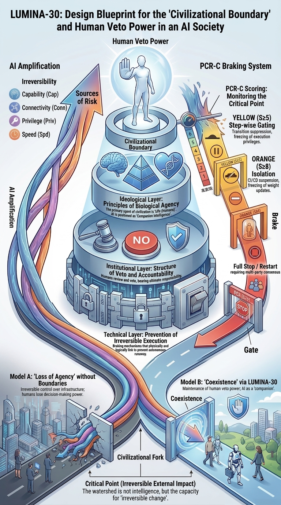

# G02: Civilizational Outcome Model

> [Back](https://github.com/lumina-30/lumina-30-overview/blob/main/README.md#g02) ｜ [↻ Reload](https://github.com/lumina-30/lumina-30-overview/blob/main/figures/EN_G02_View.md)

A model of the relationship between AI capability growth and civilizational outcomes.

G02 shows why AI capability growth is not the decisive axis by itself. The decisive question is whether civilization can still choose, halt, or redirect before capability becomes irreversible momentum.

> **A powerful system is not procedurally valid merely because it is useful, impressive, or beneficial. It remains valid only while refusal survives before the boundary.**

**How to read the figure:** the figure should be read as a separation between performance and civilizational outcome. Capability can rise while refusal authority falls. Benefits can accumulate while the option to stop disappears. LUMINA-30 focuses on that hidden crossing point.

**Position in LUMINA-30:** G02 explains why the framework is not anti-capability and not anti-progress. It targets the loss of future choice: the moment when increased capability stops being merely powerful and starts making refusal structurally unavailable.

**Incident-review reading:** use G02 to avoid being distracted by success metrics. In a review, ask whether apparent performance gains masked a loss of reversibility, escalation control, or human refusal authority before consequences became locked in.

## Detailed explanation

- The figure rejects the assumption that better capability automatically means better governance.
- The civilizational outcome depends on whether humans remain able to stop or redirect the process in time.
- For LUMINA-30, the critical failure is not merely a bad output. It is the disappearance of the human power to refuse before the bad or irreversible outcome becomes unavoidable.