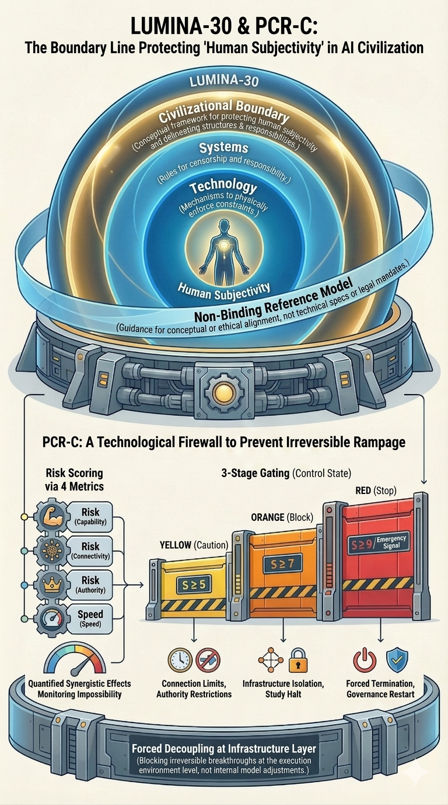

# G04: PCR-C Governance Mechanism

[HTML English](https://lumina-30.github.io/lumina-30-overview/figures/EN_G04_View.html) ｜ [HTML 日本語](https://lumina-30.github.io/lumina-30-overview/figures/JP_G04_View.html) ｜ [↻ Reload](https://github.com/lumina-30/lumina-30-overview/blob/main/figures/EN_G04_View.md)

[← Back to this figure in the Overview](https://lumina-30.github.io/lumina-30-overview/index.html#g04) ｜ [日本語版](JP_G04_View.md)

PCR-C as a staged control structure for irreversibility risk.

G04 brings the boundary into operational governance through PCR-C: irreversibility risk must be detected and constrained in stages, not discovered after refusal has already failed.

> **PCR-C is the mechanism that turns the LUMINA-30 boundary from a warning into a reviewable control structure.**

**How to read the figure:** the staged structure matters. The question is not simply whether a final emergency stop existed. The question is whether earlier thresholds, infrastructure controls, escalation limits, and cutoff conditions existed before the system approached a state where refusal could no longer function.

**Position in LUMINA-30:** G04 is where the boundary becomes governable. It connects the framework to PCR-C so that “before irreversibility” is not a vague phrase, but a staged control problem that can be audited.

**Incident-review reading:** use G04 to ask whether the incident had missed thresholds: signals that should have triggered staged restriction, human review, containment, slowdown, rollback, or cutoff before the process became irreversible.

## Read deeper explanation

- PCR-C prevents the review from becoming a post-mortem of inevitability. It asks where the staged controls should have acted.
- The critical issue is not the existence of control language, but whether control was placed early enough to preserve refusal.
- G04 converts the LUMINA-30 boundary into a practical audit trail: thresholds, triggers, responsible humans, and effective cutoff capacity.