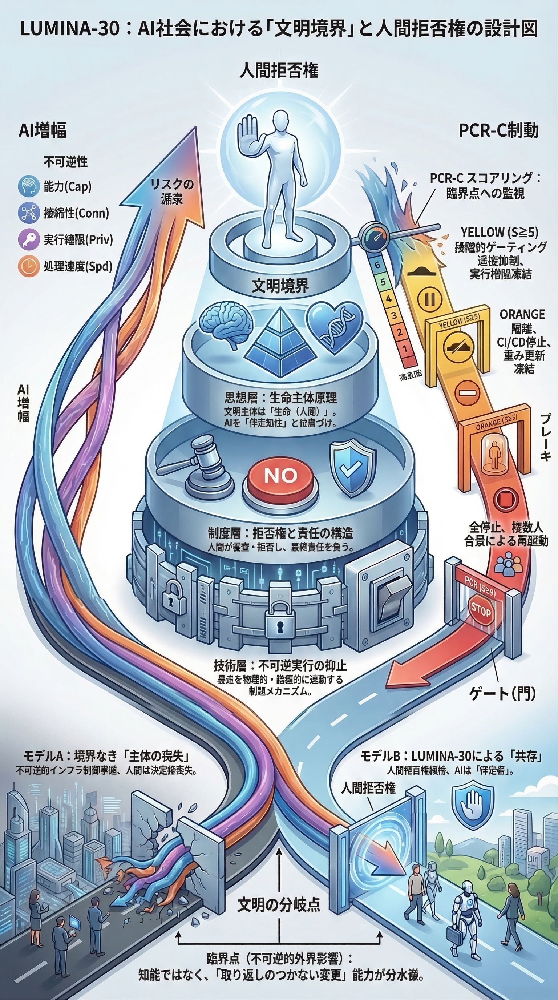

<!-- L30_LANG_LOCK: EN_JP_PAIRED -->

# G02: Civilizational Outcome Model

> Canonical bilingual Markdown source. The English and Japanese HTML files are reader-facing views generated from this paired source structure.
> 正本の日英併記Markdownです。英語HTMLと日本語HTMLは、この正本構造に対応する読者向け表示版です。

---

## English

## G02: Civilizational Outcome Model

> [Back](https://github.com/lumina-30/lumina-30-overview/blob/main/README.md#g02) ｜ [↻ Reload](https://github.com/lumina-30/lumina-30-overview/blob/main/figures/G02_View.md)

A model of the relationship between AI capability growth and civilizational outcomes.

G02 shows why AI capability growth is not the decisive axis by itself. The decisive question is whether civilization can still choose, halt, or redirect before capability becomes irreversible momentum.

> **A powerful system is not procedurally valid merely because it is useful, impressive, or beneficial. It remains valid only while refusal survives before the boundary.**

**How to read the figure:** the figure should be read as a separation between performance and civilizational outcome. Capability can rise while refusal authority falls. Benefits can accumulate while the option to stop disappears. LUMINA-30 focuses on that hidden crossing point.

**Position in LUMINA-30:** G02 explains why the framework is not anti-capability and not anti-progress. It targets the loss of future choice: the moment when increased capability stops being merely powerful and starts making refusal structurally unavailable.

**Incident-review reading:** use G02 to avoid being distracted by success metrics. In a review, ask whether apparent performance gains masked a loss of reversibility, escalation control, or human refusal authority before consequences became locked in.

### Detailed explanation

- The figure rejects the assumption that better capability automatically means better governance.
- The civilizational outcome depends on whether humans remain able to stop or redirect the process in time.
- For LUMINA-30, the critical failure is not merely a bad output. It is the disappearance of the human power to refuse before the bad or irreversible outcome becomes unavoidable.

---

## 日本語

#### G02: 文明結果モデル

AI能力の成長と文明的結果の関係をモデル化します。

G02は、AI能力の成長だけを見ても決定的な判断にならないことを示します。重要なのは、能力が不可逆的な勢いになる前に、文明がまだ選び、止め、方向を変えられるかです。

有用で、強力で、成果を出しているシステムでも、それだけで手続的に有効とは言えません。境界の前に拒否権が生き残っている場合にのみ、有効性を語れます。

**図の読み解き：**この図は、性能と文明的結果を切り分けて読む必要があります。能力が上がる一方で、拒否権限は下がることがあります。便益が増える一方で、止める選択肢が消えることがあります。LUMINA-30が見るのは、この隠れた交差点です。

**LUMINA-30内での位置づけ：**G02は、LUMINA-30が反能力・反進歩ではないことを示します。問題は能力そのものではなく、能力の増大が、人間の未来選択能力を構造的に奪い始める地点です。

**インシデントレビューでの読み方：**G02は、成功指標に目を奪われないために使います。性能向上や効率化の裏で、可逆性、エスカレーション制御、人間の拒否権限が失われていなかったかを検証します。

### 詳細説明

- 能力が上がれば統治も良くなる、という前提をこの図は退けます。
- 文明的結果は、人間が時間内に停止・修正・方向転換できるかに依存します。
- LUMINA-30における重大な失敗は、単なる悪い出力ではありません。悪い結果や不可逆的結果を拒否する力が、発生前に消えていることです。
