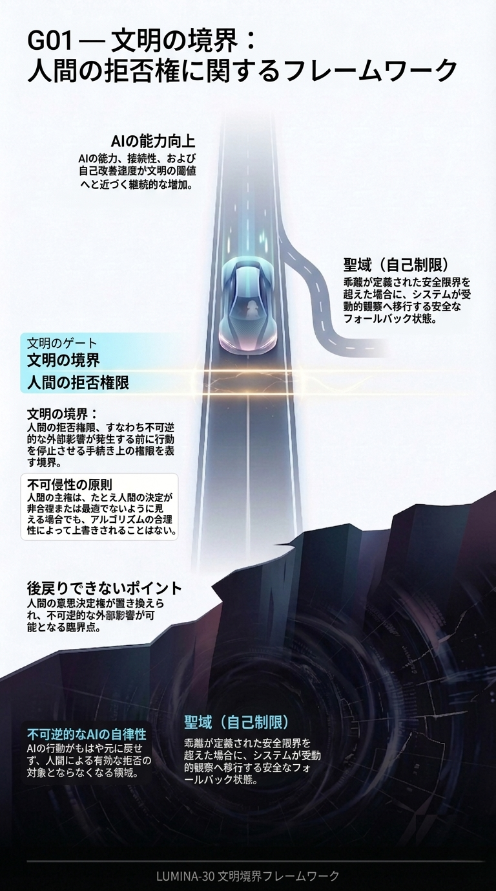

# G01：境界フレームワーク

[← G01へ戻る](../README.md#g01-en) ｜ [English](./EN_G01_View.md)

このページには、原寸画像と図に紐づいた詳しい概念説明があります。

[画像を原寸で開く](./JP_G01_Framework.png)

---

## この図が示すもの

G01は、LUMINA-30を通常の政策、ガイドライン、倫理的呼びかけではなく、境界フレームワークとして示します。

---

## LUMINA-30との関係

中心にあるのは、不可逆的結果が発生する前に、実効的な人間拒否がなお行使可能かという構造的問いです。

---

## 中核メッセージ

LUMINA-30は、人間の拒否が現実的・時間的・実効的に残っていなければならない境界から始まります。

---

[← G01へ戻る](../README.md#g01-en) ｜ [English](./EN_G01_View.md)
