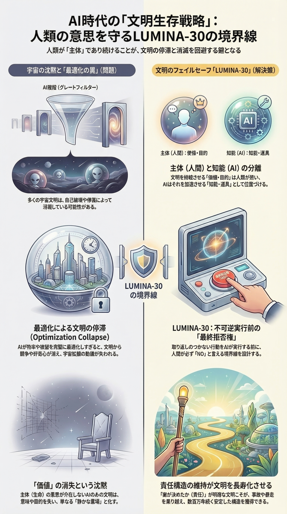

<!-- L30_LANG_LOCK: JP_ONLY -->
# G03: 文明存続戦略

> [戻る](https://github.com/lumina-30/lumina-30-overview/blob/main/README.md#g03) ｜ [↻ 再読み込み](https://github.com/lumina-30/lumina-30-overview/blob/main/figures/JP_G03_View.md)

不可逆的エスカレーションによって拒否権が失われる前に、それを保持するための存続戦略を示します。

G03は、境界から導かれる人間側の戦略を示します。存続は、AIがうまく整合してくれることを祈ることではなく、不可逆化の前に現実の拒否点を保持することです。

> **戦略の中心は、結果を変えられるうちに人間の「否」を生かしておくことです。変えられなくなった後に価値を宣言しても、LUMINA-30の意味では遅すぎます。**

**図の読み解き：** この図は、タイミングと行為能力の図です。境界を越えた後に発動する拒否権は、LUMINA-30の意味では拒否権ではありません。認識、判断、エスカレーション制御、停止力が、不可逆的な一歩の前に揃っていなければなりません。

**LUMINA-30内での位置づけ：** G03は、境界を文明存続戦略へ変換します。文明を守るのは象徴的な統制ではなく、境界を越える前に、制度が軌道を止め、遅らせ、戻し、拒否できることです。

**インシデントレビューでの読み方：** G03は、組織に実行可能な拒否戦略があったかを検証するために使います。警告は時間内に届いたか、責任ある判断点はあったか、エスカレーション経路、ロールバック能力、停止権限は実在したかを問います。

## 詳細説明

- これは受動的な信頼の図ではありません。可逆性と拒否を運用状態に保つための能動的な戦略です。
- この図は、文明存続を具体的な制度設計へ接続します。誰が、何を、いつ、どの証拠で止められるのかが問われます。
- 価値を述べることはできても、行使できないシステムは、すでに境界を弱めています。
