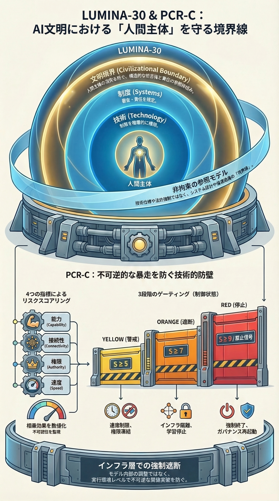

<!-- L30_LANG_LOCK: JP_ONLY -->
# G04: PCR-C ガバナンス機構

> [戻る](https://github.com/lumina-30/lumina-30-overview/blob/main/README.md#g04) ｜ [↻ 再読み込み](https://github.com/lumina-30/lumina-30-overview/blob/main/figures/JP_G04_View.md)

PCR-Cを、不可逆性リスクに対する段階的制御構造として示します。

G04は、PCR-Cによって境界を実務の統治へ持ち込みます。不可逆性リスクは、拒否が失敗した後に発見するものではなく、段階的に検出し、制約する対象として扱います。

> **PCR-Cは、LUMINA-30の境界を警告に留めず、レビュー可能な制御構造へ変える機構です。**

**図の読み解き：** 段階構造そのものが重要です。最後の非常停止があったかだけを問う図ではありません。システムが人間拒否の機能しない状態へ近づく前に、早期閾値、インフラ制御、エスカレーション制限、カットオフ条件が存在していたかを問います。

**LUMINA-30内での位置づけ：** G04は、境界を統治可能にする図です。「不可逆化の前に」という言葉を曖昧な警告にせず、監査できる段階的制御問題として扱えるようにします。

**インシデントレビューでの読み方：** G04は、事故の前に見落とされた閾値を探すために使います。制限、人間レビュー、封じ込め、減速、ロールバック、カットオフの発動を検討できた兆候がなかったかを検証します。

## 詳細説明

- PCR-Cは、レビューを「避けられなかった事故」の事後説明で終わらせません。どの段階で制御が働けたか、または欠けていたかを問います。
- 重要なのは、制御という言葉があったかではなく、拒否を保てるだけ早い位置に制御が置かれていたかです。
- G04は、閾値、トリガー、責任者、実効的なカットオフ能力という監査可能な記録へ、LUMINA-30の境界を変換します。
